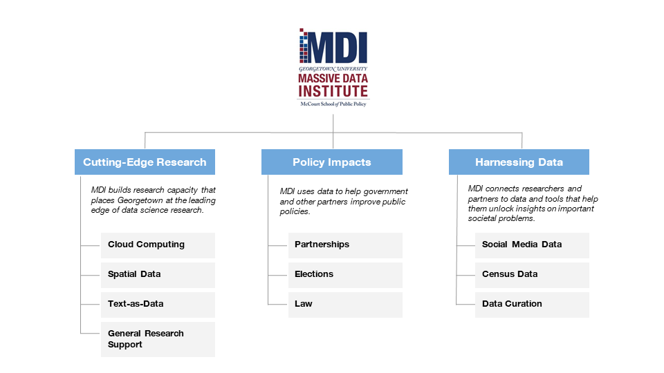

```{r setup, include=FALSE}
# Clear objects from memory
rm(list = ls(all = TRUE))   
options(htmltools.dir.version = FALSE)
library(here)
library(knitr)
library("DiagrammeR")
```

class: title-slide

background-image: url(Figures/McCourtTitle.png)


.bg-text[
<hr /> 
## Massive Data
## Institute

<hr />
Michael Bailey
]


---
  
# Mission
MDI harnesses modern computing power to improve public policy.

--

<br>

### Organizing principles

  - Interdisciplinary: MDI brings together social scientists, computer scientists and others from all schools at Georgetown.

  - Entrepreneurial: MDI seeks out and supports projects that involve novel uses of data and computing power.
  
  - Partnership-driven: MDI leverages partnerships and external funding. 
  
---

class: hide-logo

<br>


```{r, dpi = 2000, out.width="85%", fig.align = 'center', echo = FALSE}

```


---

class: left, middle, inverse, hide-logo
background-position: center
background-size: cover

background-image: url("Figures/McCourtTitle.png")

# Cutting-Edge
# Research


---

## Computing Resources


#### Achievements
Georgetown scholars have used cloud computing to connect new forms of large-scale data to societal scale issues ranging from corruption in public-private partnerships to climate change to understanding civil service to global biodiversity. Some projects have created databases that will become shared respositories for researchers  while others involve large-scale simulations.

#### Services
We provide access to cloud computing for faculty who need large-scale and fast computing resources.  Our services include compute clusters, large-scale databases including Postgres and BigQuery and access to statistical packages for large-scale data and private cloud-based storage. 

We will be increasing our services next year to include creation of data portals and data labeling services using Mechanical Turk.

#### Contacts
If you are interested in using our cloud computing or Mechanical Turk resources, please contact Lisa Singh (MDI Research Professor) or Virinche Marwadi (MDI System Administrator).

---

## Research support

#### Achievements
MDI has created a MDI Scholars program that provides undergraduate and Master's students with research experience using large-scale data. The Scholars have participated in over 10 different research projects led by faculty across campus and have been involved in research publications.

Funded by a substantial NSF grant, MDI Research Professor Sing directs a interdisciplinary group of scholars who develop research tools for scholars using social media and other modern data in cross-disciplinary research.

MDI's seed grants have funded Georgetown researchers in Public Policy, Biology, Business, Government, the School of Foreign Service and elsewhere.  Scholars receiving these grants have gone on to raise over $3.5 million in grants.


#### Services
MDI can connect researchers to faculty and student data science experts. MDI can also provide support for researchers applying for grants.

#### Contact
If you would like to hire students with data science skills, contact Jonathan Beam (MDI Program Coordinator). If interested in grant support, contact Tricia Waller (Director, Grants Administration for MDI).

---

## Text as data

#### Achievements

MDI scholars have used text-as-data tools to analyze social media and newspaper data the understand the 2020 US election, online social movements (#MeToo and #BlackLivesMatter), forced migration in Iraq, Covid spread, Covid misinformation and gun ownership.

MDI also convenes events designed to build the text-as-data community at Georgetown.

#### Services
We build and support a community of scholars doing research on text as data.  This includes programming for faculty and a Phd-oriented working group.  We hope to offer a web-scraping consulting service via our MDI Fellow.

#### Contacts
If you would like more information about our text-as-data working group, please contact Jaren Haber (MDI Fellow).  If you would like more information about the text-as-data community at MDI or are interested in hiring research support in this area, please contact Michael Bailey (MDI Director).


---

## Spatial data

#### Achievements
MDI has convened a university-wide meeting on spatial data and followed up with the creation of a committee that that seeks to build cutting-edge research capacity.

#### Services
We are developing plans to support research using spatial data, including possible staffing and other support.


#### Contact
If you would like more information about MDI's spatial data community, contact Michael Bailey (MDI Director).

---


class: left, middle, inverse, hide-logo
background-position: center
background-size: cover

background-image: url("Figures/McCourtTitle.png")

# Policy
# Impacts


---

## Partners

#### Achievements
MDI has worked with multiple partners on policy-projects. We have worked with a government agency in Washington and have a Fellow at the Lab\@DC.  Working with interdisciplinary partners via Georgetown's Tech \& Society, MDI has sponsored a Fellows with working on racial justice in the law and ethics in data science.

#### Services
MDI can work with local governments, public policy organizations and university researchers to create a team that can provide high end data services in a data-driven analysis of a public policy question.

#### Contact
If you would like more information on working with MDI on policy-relevant data analysis, please contact Amy O'Hara (MDI Research Professor) or Michael Bailey (MDI Director).


---

## Democracy

#### Achievements
MDI has undertaken projects assessing the nature and content of election information.  This work is joint with the University of Michigan and partners have included CNN and Gallup.  This work includes high-profile, current-use [data](https://s3mc.org/political-communication/) on election dynamics at CNN.


#### Services
MDI is eager to collaborate with scholars interested in using our data or building off our experience analyzing campaigns and elections.


#### Contact
If you would to know more about MDI's election research and data, please contact Lisa Singh (MDI Research Professor) or Michael Bailey (MDI Director).


---

## Data Access

#### Achievements
MDI has engaged directly in policy debates about how policymakers can provide and use data in an effective and ethical manner.  Our ADRI project has received generous support from the Sloan Foundation to promote the use of administrative data.


#### Services
Specific outputs include guides of best practices and a directory of intermediaries that can assist in such efforts. [plus]

Our Census project helps states compare their data to the data being produced by the U.S. Census.

Our Facebook project helped assess their efforts to provide social scientists access to some of their data.

#### Contact
If you would to know more about MDI's efforts to enable effective and ethical use of policy data, please contact Amy O'Hara (MDI Research Professor).


---

## Legal system

#### Achievements
MDI is engaged in multiple projects related to the U.S. legal system.  
- Working with the Georgetown University Law Center, we are creating a civil justice data commons that will help researchers understand racial and other implications of civil justice in the United States.
- Working with the Justice Innovation Lab, MDI researchers are trying to make the legal process more fair at the prosecutorial level.
- MDI researchers have also developed innovative ways to measure the influence of law and policy on Supreme Court justices.

#### Services
[ explain ] 

#### Contact
If you would to know more about MDI's efforts to use data to better understand the U.S. legal system, please contact Amy O'Hara (MDI Research Professor) or Michael Bailey (MDI Director).


---


class: left, middle, inverse, hide-logo
background-position: center
background-size: cover

background-image: url("Figures/McCourtTitle.png")

# Harnessing
# Data


---

## Federal Statistical Research Data Center 

#### Achievements
The FSRDC is open again!  Thanks to the Restarting Research protocols and collaboration between the McCourt School and Census Bureau, our approved researchers can safely and securely access restricted data.  The FSRDC has generated interest across area non-profits and institutions.  Scholars using our U.S. Census Bureau Research Data Center have produced multiple working papers and journal articles. 

#### Services
MDI provides access to non-public U.S. Census data at our secure on-sight U.S. Census Research Data Center.  We support researchers by helping them learn about what data is available, apply for access and, if approved, to access the data.  Executive Director Amy O'Hara serves on the FSRDC Technical Committee and on the FSRDC Budget Committee.  She also works with the Census Bureau to streamline data request processes and improve linkage methods.

#### Contact
If you would like more information MDI's Research Data Center, please contact Amy O'Hara (FSRDC Director).

---

## Social Media Data Portals

We have developed four portals to date: election 2020, covid-19, and parenting. These portals are controlled by research teams, but allow for construction of variables from socail media and newspaper data through easy to use forms. It is particularly valuable for those with limited large-scale data programming skills. 

#### Services
MDI is developing a service that will give researchers access to variables constructed from the Twitter decahose. 

#### Contact
If you would like more information accessing social media data, please contact Lisa Singh (MDI Research Professor).


---

## Data curation

#### Achievements
We have developed efficient approaches for storing and processing these large-scale data sets. Currently, we have eight projects that are curating different social media and newspaper data sets. 

#### Services
MDI can provide scholars with access to certain specific data sets.  One is a large scale database of more than 700 million publicly available, open-source media articles and blog posts actively compiled since 2006 from a wide range of non-English sources.  Another is a very large data set of anonymized credit information.

MDI also makes available [administrative data metadata](https://mccourt.georgetown.edu/research/research-data-center/administrative-data-metadata/) obtained through data use agreements with federal and state agencies which show the specific data elements shared with the census in order to improve research designs and increase the specificity of proposals.

We are also exploring whether we can assist in other data access projects.

#### Contact
If you would like more information MDI's data curation, please contact Amy O'Hara (FSRDC Director), Lisa Singh (MDI Research Professor) or Michael Bailey (MDI Director).
